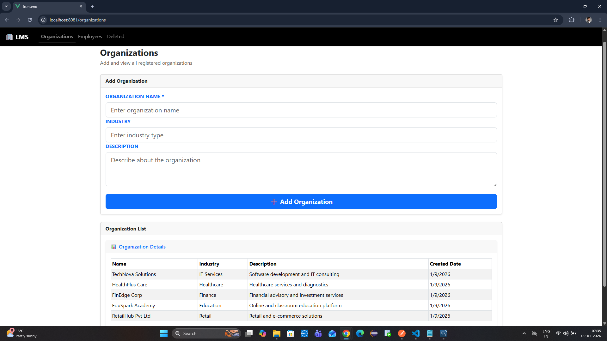
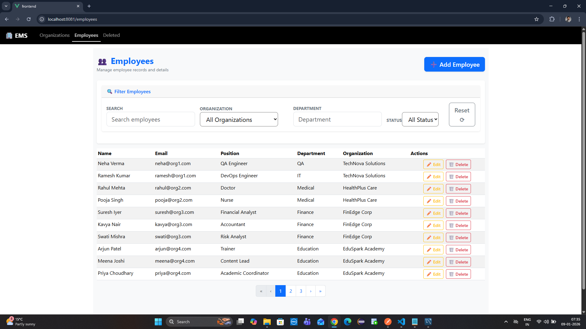
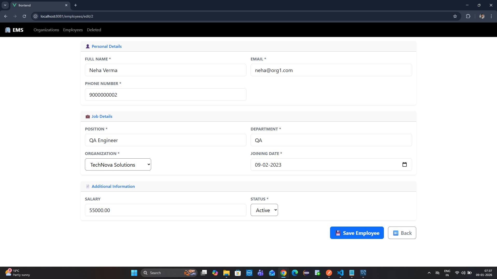
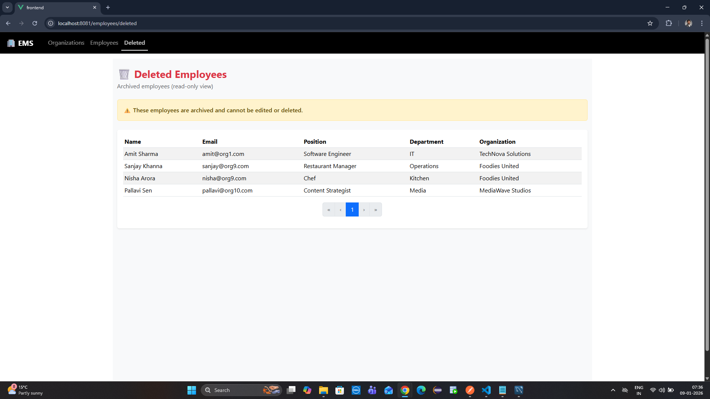

# 🧑‍💼 Employee Management System

## 📌 Project Overview

The **Employee Management System** is a full-stack web application built using **Vue.js 2** for the frontend and **Node.js (Express.js)** for the backend.

It allows organizations to manage employees efficiently with features such as:

- Employee creation and editing
- Soft deletion
- Search, filtering, and pagination
- Frontend and backend validations

The application follows **clean architecture principles** with proper separation of concerns and meaningful error handling.

---

## 🛠️ Tech Stack

### Frontend
- Vue.js 2
- Vue Router
- Axios
- BootstrapVue

### Backend
- Node.js
- Express.js

### Database
- MySQL

---

## ✅ Features Implemented

### 🏢 Organization Management
- Create organizations
- View organizations with pagination
- Auto-generated creation date

### 👨‍💼 Employee Management
- Add employee
- Edit employee
- Soft delete employee
- View deleted employees

### 🔍 Search, Filter & Pagination
- Pagination support
- Search by:
  - Name
  - Email
  - Position
  - Department
- Filter by:
  - Organization
  - Department
  - Status
- Multiple filters working together

### ✔️ Validations & Error Handling
- Frontend & backend validations
- Unique email enforcement
- Meaningful error messages
- Proper HTTP status codes

---

## 📋 Prerequisites

Make sure the following are installed on your system:

- Visual Studio Code
- Node.js (v16+ recommended)
- npm
- MySQL
- Vue CLI

Install Vue CLI globally:

npm install -g @vue/cli
⚙️ Setup & Run Instructions
1️⃣ Clone the Repository

git clone <your-github-repo-url>
cd employee-management-system

2️⃣ Backend Setup

cd backend
npm install
Configure Database
Update database credentials in:

backend/src/config/db.js
Example:

module.exports = mysql.createConnection({
  host: 'localhost',
  user: 'root',
  password: 'password',
  database: 'employee_management'
});
Run Backend

npm run dev
Backend runs on:

arduino
Copy code
http://localhost:5000

3️⃣ Frontend Setup

cd frontend
npm install
npm run serve
Frontend runs on:

http://localhost:8080
🔐 Environment Variables
Currently, the application uses hardcoded database configuration inside:

arduino
Copy code
backend/src/config/db.js
Example:

js
Copy code
module.exports = mysql.createConnection({
  host: 'localhost',
  user: 'your_db_user',
  password: 'your_db_password',
  database: 'ems_db'
});
ℹ️ Note: Environment variables are not used in this project.
For production deployment, it is recommended to move credentials to a .env file.

📡 API Documentation
Base URL

http://localhost:5000
🏢 Organization APIs
Method	Endpoint	Description
GET	/api/organizations	Get all organizations
POST	/api/organizations	Create a new organization

👨‍💼 Employee APIs
Method	Endpoint	Description
GET	/api/employees	Get all active employees
GET	/api/employees/deleted	Get deleted employees
POST	/api/employees	Add a new employee
PUT	/api/employees/:id	Update employee details
DELETE	/api/employees/:id	Soft delete employee
GET	/api/employees/search?query={value}	Search employees
GET	/api/employees/filter?org={org}&dept={dept}&status={status}	Filter employees

⚠️ HTTP Status Codes Used
Code	Meaning
200	Success
400	Validation error
404	Resource not found
500	Server error

🗄️ Database Schema
Organizations Table

organizations
------------
id (PK)
name
industry
description
created_at
Employees Table
scss
Copy code
employees
---------
id (PK)
full_name
email (UNIQUE)
phone
position
department
organization_id (FK)
joining_date
salary
status
is_deleted
🔗 Relationships
One Organization → Many Employees

employees.organization_id → organizations.id

## 📸 Screenshots

### Organizations

### Employees

### Add Employee

### Edit Employee

### Deleted Employees
